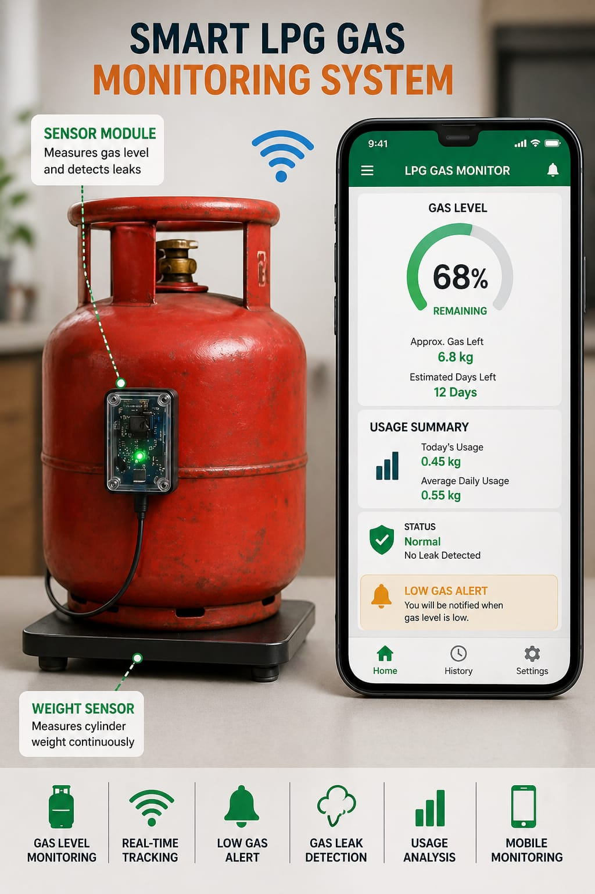

# Smart LPG Gas Monitoring & Leak Detection System

## 📌 Description
In many households, hostels, and restaurants, people often do not know how much LPG gas is left in the cylinder. This can lead to sudden gas exhaustion and inconvenience during daily activities. Additionally, unnoticed gas leakage can be dangerous.

This project aims to solve this real-life problem by using a sensor-based system to monitor gas levels and detect abnormal usage. Python is used to process the data and provide real-time information along with alerts.

---

## 🎯 Objectives
- To monitor LPG gas level in real-time  
- To alert users when gas is low  
- To detect possible gas leakage  
- To analyze daily gas usage  
- To improve safety and convenience  

---

## 🚀 Features
- ⛽ Gas Level Monitoring  
- 📡 Real-Time Tracking  
- ⚠️ Low Gas Alert  
- 🔥 Gas Leak Detection  
- 📊 Usage Analysis  
- 📱 Mobile Style Output  

---

## ⚙️ How It Works
1. Sensor measures cylinder weight  
2. Data is sent to the system  
3. Python calculates gas level and usage  
4. Alerts are generated for low gas or leaks  
5. Output is displayed in mobile-style interface

---

## 🛠️ Technologies Used
- 🐍 Python – Used for backend processing and calculations  
- 🌐 IoT (Internet of Things) – Used for real-time monitoring and smart connectivity  
- ⚖️ Weight Sensor / Load Cell – Used to measure LPG cylinder weight  
- 📡 Wi-Fi / Bluetooth Communication – Used for transmitting sensor data  
- 📱 Mobile Style Interface – Used for displaying gas level and alerts  
- 🧠 Sensor-Based Monitoring – Used for tracking gas usage and leak detection  
- 💻 GitHub – Used for project hosting and version control

---
## 📱 System Design

<p align="center">
  
</p>

---


## 💻 Code

Run the program:

```bash
python lpg_monitor.py 
```
---

## 📜 License

Licensed under the MIT License.
